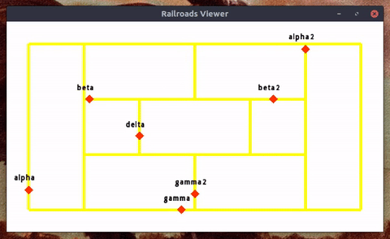
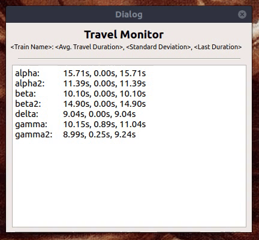
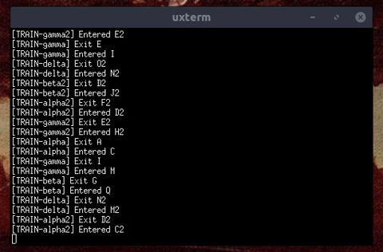
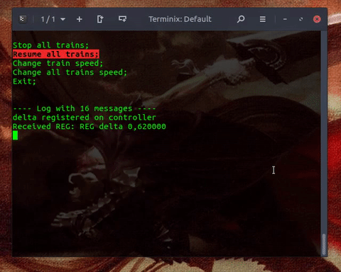

# railroads-simulator
> project developed for a class on 'Project of Operational Systems' at UFRN, with the objective of using the concepts of Threads, Semaphores, Mutexes, TCP/UDP Sockets, Signals and Slots for event-driven programming, GUI programming and synchronization problems such as Deadlocks)

This project simulates urban trains running through virtual railroads. Many of these rails are part of different paths of different trains, so there is the risk of collisions and deadlocks between them.

- The main objective of the project is to synchronize and manage the trains in such a way that, during the simulation, no collision or deadlock can occur;

The simulator is 'RailroadsSimulator' and there is also a remove controller for it made with Python3, the 'TrainsController'.

# RailroadsSimulator:
Developed with Qt creator using the C++14 standard, it is a GUI application and also a TCP Server for the TrainsController. 

## Server Setup dialog:


The application starts with a small dialog for the user to input information about the simulation: a port, an IPv4 address and the path to a graph file defining the railroads in the simulation. These files are in the 'railroads' directory.

Once the server is running and the simulation has begun, the following 3 windows will open:

## Railroads Viewer:


This window enables the user to visualize in real time the railroads and the trains. It was developed using the SFML2 graphical library. In the example above, the trains are the markers named after the first letters in the greek alphabet.

## Travel Monitor:


Based on the last completed routes of the trains, calculates and displays statistics about the time they take to travel their entire path.

## Logging System:


A text-based logging system who receives information from all the running threads on the project.

## Building it:

Requirements:
- POSIX based system;
- Qt Creator (>= 5);
- GCC (>= 6.3);
- SFML (>= 2.4.2);
  - Package: libsfml-dev;
### Instructions:
```shell
$ <missing instructions>
```

# TrainsController:


Remote controller to the simulation that uses a CLI interface. Can stop trains, resume trains and change their speed. Like the 'RailroadsSimulator', it also has it's own logging system. Developed using Python3 and the Blessed module for the CLI interface.

## Building it:

Requirements:
- Python (>= 3.4);
- Blessed(for CLI interface);

### Instructions:
```shell
$ python3 controller.py <host-ipv4-address> <host-port>
$ EXAMPLE:
$ python3 controller.py 127.0.0.1 50002
```
